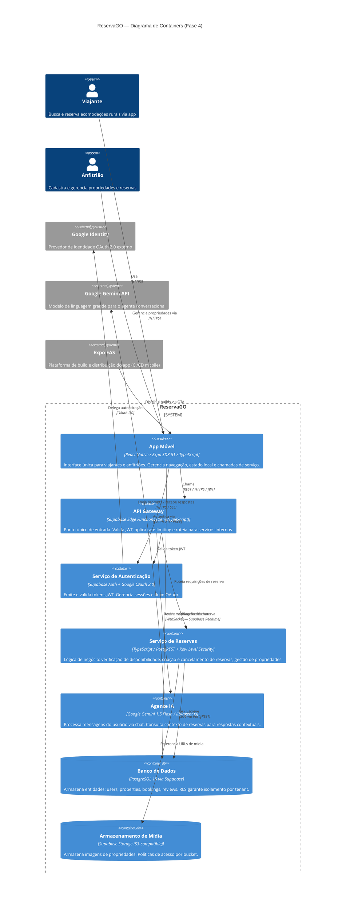

# ReservaGO

> **Plataforma móvel de reservas para acomodações rurais e em contato com a natureza.**
> Ciclo 3 — Arquitetura Cloud e Microsserviços

[](https://expo.dev)
[](https://supabase.com)
[](https://www.typescriptlang.org)

---

## Visão Executiva

**Problema:** O mercado de hospedagem rural e em contato com a natureza no Brasil é fragmentado — sem plataforma digital consolidada para descoberta, reserva e gestão dessas experiências.

**Solução:** ReservaGO é um aplicativo mobile (iOS/Android) que conecta viajantes a anfitriões de propriedades como fazendas, glamping, pousadas rurais e áreas de ecoturismo. A plataforma oferece listagem de propriedades com galeria de imagens, sistema de reservas com controle de disponibilidade, autenticação via Google OAuth e um agente conversacional baseado em IA (Google Gemini) para assistência ao usuário.

**Estado atual — Fase 4 (Ciclo 3):** A arquitetura evoluiu de um modelo monolítico BaaS (Backend as a Service) para uma arquitetura orientada a serviços em nuvem. As responsabilidades foram decompostas em serviços lógicos independentes — Autenticação, Reservas e Agente IA — orquestrados por uma camada de API Gateway (Supabase Edge Functions). A base de dados PostgreSQL (Supabase) mantém consistência transacional, enquanto o Supabase Realtime provê canal assíncrono para notificações de status de reserva em tempo real.

---

## Diagrama C4 — Containers



---

## Decisões Arquiteturais (ADRs)

| # | Título | Status | Resumo |
|---|--------|--------|--------|
| [ADR 0001](./docs/adrs/0001-estrategia-nuvem.md) | Estratégia de Nuvem e Escalabilidade | ✅ Aceito | PaaS via Supabase + Expo EAS; escalabilidade horizontal via pgBouncer e Edge Functions serverless |
| [ADR 0002](./docs/adrs/0002-padrao-resiliencia.md) | Padrões de Resiliência | ✅ Aceito | API Gateway (Edge Functions) + Circuit Breaker para Gemini API + Retry com exponential backoff |
| [ADR 0003](./docs/adrs/0003-modelo-comunicacao.md) | Modelo de Comunicação | ✅ Aceito | REST síncrono para operações transacionais + WebSocket assíncrono (Realtime) para notificações + SSE para chat IA |

---

## Documentação Arquitetural

- 📄 [SAD — Fase 4](./docs/sad/sad-fase3.md) — Software Architecture Document completo
- 📂 [Diagramas](./docs/diagrams/) — Artefatos visuais complementares

---

## Como Executar Localmente

### Pré-requisitos

```bash
node --version    # >= 18.x
npm --version     # >= 9.x
npx expo --version  # SDK 51
```

### 1. Clonar e instalar

```bash
git clone https://github.com/<org>/reservago.git
cd reservago
npm install
```

### 2. Configurar variáveis de ambiente

```bash
cp .env.example .env
```

Preencher no `.env`:

```env
EXPO_PUBLIC_SUPABASE_URL=https://<project>.supabase.co
EXPO_PUBLIC_SUPABASE_ANON_KEY=<anon_key>
EXPO_PUBLIC_GEMINI_API_KEY=<gemini_key>
EXPO_PUBLIC_GOOGLE_CLIENT_ID=<google_client_id>
```

> ⚠️ `EXPO_PUBLIC_GEMINI_API_KEY` só deve ser usada em ambiente de desenvolvimento. Em produção, a chave deve residir exclusivamente em Edge Functions.

### 3. Iniciar o app

```bash
# Expo Go (desenvolvimento rápido)
npx expo start

# Emulador Android
npx expo run:android

# Simulador iOS (macOS apenas)
npx expo run:ios
```

### 4. Banco de dados — instância local (opcional)

```bash
# Instalar Supabase CLI
npm install -g supabase

# Iniciar instância local (requer Docker)
supabase start

# Aplicar migrações
supabase db push
```

---

## Estrutura do Repositório

```
reservago/
├── src/                    # Código-fonte do app (screens, components, lib)
├── docs/
│   ├── adrs/               # Architecture Decision Records
│   │   ├── 0001-estrategia-nuvem.md
│   │   ├── 0002-padrao-resiliencia.md
│   │   └── 0003-modelo-comunicacao.md
│   ├── sad/
│   │   └── sad-fase3.md    # Software Architecture Document
│   └── diagrams/           # Diagramas complementares
├── gold-plating/           # Artefatos de excelência técnica
├── README.md               # Dossiê arquitetural (este arquivo)
└── .gitignore
```

---

## Equipe

| Membro | Papel |
|--------|-------|
| Arthur Caixeta | Frontend, Code Review, Documentação Técnica |
| Deusmair Júnior (JuniorPrado99) | Lead Frontend / Técnico |
| Ian Couto | Mobile Dev / Integrações Backend |

---

*Ciclo 3 — Mini Projeto Arquiteto Decisor · 7º Semestre*
